# OSCAR Implementation - Comprehensive Diagrams & Figures

This document provides various visual representations of the current OSCAR implementation, including architecture diagrams, data flows, security models, and operational workflows.

## 1. System Architecture Diagrams

### 1.1 High-Level System Architecture

```mermaid
flowchart TB
    %% User Interface
    subgraph UI ["🎨 User Interface"]
        User["👤 User"]
        Slack["💬 Slack"]
    end
    
    %% Core Infrastructure
    subgraph Core ["⚡ Core Infrastructure"]
        Gateway["🌐 API Gateway"]
        Lambda["⚡ Routing Lambda<br>(oscar-supervisor-agent)"]
        Context[("💾 DynamoDB<br>Conversation Context")]
    end
    
    %% AI Processing
    subgraph AI ["🤖 AI Processing"]
        Privileged["🔑 Privileged Agent<br>AWS Bedrock"]
        Limited["👁️ Limited Agent<br>AWS Bedrock"]
        Knowledge[("📚 Knowledge Base<br>RAG System")]
    end
    
    %% Specialist Services
    subgraph Services ["🔧 Specialist Services"]
        Jenkins["🔧 Jenkins Agent"]
        Metrics["📊 Metrics Agents"]
        Communication["📢 Communication Action Group"]
        Future["🚀 Future Agents"]
    end
    
    %% Execution Layer
    subgraph Execution ["⚙️ Execution Layer"]
        JenkinsLambda["⚡ Jenkins Lambda<br>(oscar-jenkins-agent)"]
        MetricsLambda["⚡ Metrics Lambda<br>(oscar-metrics-agent)"]
        CommLambda["⚡ Communication Lambda<br>(oscar-communication-agent)"]
    end
    
    %% External Systems
    subgraph External ["🌐 External Systems"]
        JenkinsAPI["🏗️ Jenkins API<br>build.ci.opensearch.org"]
        OSCluster["📈 OpenSearch Clusters<br>Metrics Data"]
        SlackAPI["💬 Slack API<br>Multi-channel Messaging"]
    end
    
    %% Connections
    User --> Slack
    Slack --> Gateway
    Gateway --> Lambda
    Lambda <--> Context
    
    Lambda --> Privileged
    Lambda --> Limited
    Lambda --> Slack
    
    Privileged --> Jenkins
    Privileged --> Metrics
    Privileged --> Communication
    Privileged --> Knowledge
    Privileged --> Future
    
    Limited --> Metrics
    Limited --> Knowledge
    Limited --> Future
    
    Jenkins --> JenkinsLambda
    Metrics --> MetricsLambda
    Communication --> CommLambda
    
    JenkinsLambda --> JenkinsAPI
    MetricsLambda --> OSCluster
    CommLambda --> SlackAPI
    CommLambda --> Context
    
    %% Styling
    classDef user fill:#e1f5fe
    classDef slack fill:#4a148c,color:#fff
    classDef aws fill:#ff9800,color:#fff
    classDef agent fill:#2e7d32,color:#fff
    classDef specialist fill:#1565c0,color:#fff
    classDef knowledge fill:#9c27b0,color:#fff
    classDef data fill:#6a1b9a,color:#fff
    
    class User user
    class Slack slack
    class Gateway,Lambda,JenkinsLambda,MetricsLambda,CommLambda,Context aws
    class Privileged,Limited agent
    class Jenkins,Metrics,Communication,Future specialist
    class Knowledge knowledge
    class JenkinsAPI,OSCluster,SlackAPI data
```

### 1.2 Detailed Component Architecture

## 2. Data Flow Diagrams

### 2.1 User Query Processing Flow

### 2.2 Multi-Agent Coordination Flow

## 3. Security & Authorization Models

### 3.1 Dual-Agent Security Architecture

```mermaid
flowchart LR
    subgraph "User Authorization"
        UserRequest["User Request"]
        AuthCheck{"Authorization Check"}
        FullyAuth["FULLY_AUTHORIZED_USERS"]
        Others["All Other Users"]
    end
    
    subgraph "Agent Routing"
        PrivilegedAgent["🔑 Privileged Agent"]
        LimitedAgent["👁️ Limited Agent"]
    end
    
    subgraph "Function Access"
        FullAccess["✅ Full Access:<br/>• Jenkins execution<br/>• Cross-channel messaging<br/>• System modifications<br/>• Administrative functions"]
        ReadOnly["📖 Read-Only Access:<br/>• Information queries<br/>• Status reports<br/>• Documentation access<br/>• Educational content"]
    end
    
    subgraph "Audit & Compliance"
        AuditLog["📝 Audit Trail:<br/>[USER_ID: user123]<br/>Action: trigger_job<br/>Timestamp: 2024-01-15T10:30:00Z<br/>Parameters: {...}"]
    end
    
    UserRequest --> AuthCheck
    AuthCheck -->|In List| FullyAuth
    AuthCheck -->|Not In List| Others
    FullyAuth --> PrivilegedAgent
    Others --> LimitedAgent
    PrivilegedAgent --> FullAccess
    LimitedAgent --> ReadOnly
    FullAccess --> AuditLog
    ReadOnly --> AuditLog
    
    classDef user fill:#e1f5fe
    classDef security fill:#d32f2f,color:#fff
    classDef privileged fill:#2e7d32,color:#fff
    classDef limited fill:#ff9800,color:#fff
    classDef audit fill:#6a1b9a,color:#fff
    
    class UserRequest user
    class AuthCheck,FullyAuth,Others security
    class PrivilegedAgent,FullAccess privileged
    class LimitedAgent,ReadOnly limited
    class AuditLog audit
```

### 3.2 Confirmation Workflow Process

## 4. Operational Workflows

### 4.1 Jenkins Job Execution Workflow

```mermaid
flowchart TD
    Start([User Request]) --> Parse[Parse Natural Language]
    Parse --> Identify{Identify Job Type}
    
    Identify -->|docker-scan| DockerScan[Docker Security Scan]
    Identify -->|central-release-promotion| ReleasePromo[Release Promotion]
    Identify -->|Unknown| Error[Error: Unknown Job]
    
    DockerScan --> ValidateParams[Validate IMAGE_FULL_NAME]
    ReleasePromo --> ValidateRelease[Validate Release Parameters]
    
    ValidateParams --> ShowDetails[Show Job Details]
    ValidateRelease --> ShowDetails
    
    ShowDetails --> Confirm{User Confirms?}
    Confirm -->|Yes| Execute[Execute Job]
    Confirm -->|No| Cancel[Cancel Operation]
    
    Execute --> Monitor[Monitor Progress]
    Monitor --> Success{Job Success?}
    
    Success -->|Yes| SuccessResponse[✅ Success Response<br/>with Job URL]
    Success -->|No| FailureResponse[❌ Failure Response<br/>with Error Details]
    
    Cancel --> CancelResponse[Operation Cancelled]
    Error --> ErrorResponse[Error Message]
    
    SuccessResponse --> End([Complete])
    FailureResponse --> End
    CancelResponse --> End
    ErrorResponse --> End
```

### 4.2 Metrics Analysis Workflow

## 5. Communication & Messaging Flows

### 5.1 Cross-Channel Communication Architecture

```mermaid
graph TB
    subgraph "Input Methods"
        ChatMsg["💬 Chat Message"]
        SlashCmd["⚡ Slash Command"]
        DirectMsg["📱 Direct Message"]
    end
    
    subgraph "Communication Processing"
        CommAgent["📢 Communication Agent"]
        CommLambda["⚡ Communication Lambda"]
        TargetResolver["🎯 Target Resolver"]
    end
    
    subgraph "Message Formatting"
        RichFormat["🎨 Rich Formatting"]
        Interactive["🎛️ Interactive Elements"]
        Markdown["📝 Markdown Processing"]
    end
    
    subgraph "Delivery Channels"
        Release["#opensearch-release"]
        Build["#opensearch-build"]
        Infra["#opensearch-infra"]
        DM["📱 Direct Messages"]
    end
    
    subgraph "Audit & Storage"
        DeliveryLog["📊 Delivery Tracking"]
        ContextStore["💾 Context Storage"]
        AuditTrail["📝 Audit Trail"]
    end
    
    ChatMsg --> CommAgent
    SlashCmd --> CommAgent
    DirectMsg --> CommAgent
    
    CommAgent --> CommLambda
    CommLambda --> TargetResolver
    TargetResolver --> RichFormat
    
    RichFormat --> Interactive
    Interactive --> Markdown
    
    Markdown --> Release
    Markdown --> Build
    Markdown --> Infra
    Markdown --> DM
    
    CommLambda --> DeliveryLog
    CommLambda --> ContextStore
    CommLambda --> AuditTrail
```

### 5.2 Emoji Reaction Feedback System

## 6. Infrastructure & Deployment Diagrams

### 6.1 AWS Infrastructure Layout

```mermaid
graph TB
    subgraph "API Layer"
        APIGateway["🌐 API Gateway"]
        CloudFront["☁️ CloudFront (Optional)"]
    end
    
    subgraph "Compute Layer"
        SupervisorLambda["⚡ Supervisor Lambda"]
        JenkinsLambda["⚡ Jenkins Lambda"]
        MetricsLambda["⚡ Metrics Lambda"]
        CommLambda["⚡ Communication Lambda"]
    end
    
    subgraph "AI Services"
        Bedrock["🤖 AWS Bedrock"]
        BedrockAgents["👥 Bedrock Agents"]
    end
    
    subgraph "Storage Layer"
        DynamoDB["💾 DynamoDB"]
        S3["📦 S3 Buckets"]
        SecretsManager["🔐 Secrets Manager"]
    end
    
    subgraph "Monitoring & Logging"
        CloudWatch["📊 CloudWatch"]
        CloudTrail["🔍 CloudTrail"]
        XRay["📈 X-Ray (Optional)"]
    end
    
    subgraph "Security & Access"
        IAM["🛡️ IAM Roles"]
        VPC["🏠 VPC (Optional)"]
        SecurityGroups["🔒 Security Groups"]
    end
    
    APIGateway --> SupervisorLambda
    SupervisorLambda --> Bedrock
    SupervisorLambda --> DynamoDB
    
    Bedrock --> BedrockAgents
    BedrockAgents --> JenkinsLambda
    BedrockAgents --> MetricsLambda
    BedrockAgents --> CommLambda
    
    JenkinsLambda --> SecretsManager
    MetricsLambda --> S3
    CommLambda --> DynamoDB
    
    SupervisorLambda --> CloudWatch
    JenkinsLambda --> CloudWatch
    MetricsLambda --> CloudWatch
    CommLambda --> CloudWatch
    
    IAM --> SupervisorLambda
    IAM --> JenkinsLambda
    IAM --> MetricsLambda
    IAM --> CommLambda
```

### 6.2 Knowledge Base Architecture

```mermaid
graph TB
    subgraph "Knowledge Sources"
        Wiki["📖 OSEE Wiki"]
        GitHub["📁 GitHub READMEs"]
        Procedures["📋 Release Procedures"]
        Troubleshooting["🔧 Troubleshooting Guides"]
    end
    
    subgraph "Ingestion Pipeline"
        Crawler["🕷️ Document Crawler"]
        Processor["⚙️ Text Processor"]
        Chunker["✂️ Document Chunker"]
        Embedder["🧠 Vector Embedder"]
    end
    
    subgraph "Storage & Retrieval"
        S3Raw["📦 S3 Raw Documents"]
        VectorDB["🔍 Vector Database"]
        Metadata["📊 Document Metadata"]
        SearchIndex["🔎 Search Index"]
    end
    
    subgraph "Query Processing"
        QueryParser["❓ Query Parser"]
        SemanticSearch["🎯 Semantic Search"]
        Ranker["📈 Relevance Ranker"]
        SourceAttribution["📝 Source Attribution"]
    end
    
    Wiki --> Crawler
    GitHub --> Crawler
    Procedures --> Crawler
    Troubleshooting --> Crawler
    
    Crawler --> Processor
    Processor --> Chunker
    Chunker --> Embedder
    
    Embedder --> S3Raw
    Embedder --> VectorDB
    Embedder --> Metadata
    Embedder --> SearchIndex
    
    QueryParser --> SemanticSearch
    SemanticSearch --> VectorDB
    VectorDB --> Ranker
    Ranker --> SourceAttribution
```

## 7. Error Handling & Recovery Patterns

### 7.1 Error Handling Flow

```mermaid
flowchart TD
    Error([Error Occurs]) --> Classify{Classify Error Type}
    
    Classify -->|Timeout| TimeoutHandler[Timeout Handler]
    Classify -->|Rate Limit| RateLimitHandler[Rate Limit Handler]
    Classify -->|Auth Error| AuthHandler[Auth Error Handler]
    Classify -->|System Error| SystemHandler[System Error Handler]
    
    TimeoutHandler --> TimeoutMsg["⏱️ Request taking longer than expected"]
    RateLimitHandler --> RateMsg["🚦 High load, please wait"]
    AuthHandler --> AuthMsg["🔐 Authorization required"]
    SystemHandler --> SystemMsg["⚠️ System error occurred"]
    
    TimeoutMsg --> LogError[Log Error Details]
    RateMsg --> LogError
    AuthMsg --> LogError
    SystemMsg --> LogError
    
    LogError --> UpdateReactions[Update Emoji Reactions]
    UpdateReactions --> NotifyUser[Send User-Friendly Message]
    NotifyUser --> End([Recovery Complete])
```

### 7.2 Graceful Degradation Strategy

```mermaid
graph LR
    subgraph "Service Health Monitoring"
        HealthCheck["🏥 Health Checks"]
        ServiceStatus["📊 Service Status"]
    end
    
    subgraph "Degradation Levels"
        FullService["🟢 Full Service"]
        PartialService["🟡 Partial Service"]
        ReadOnlyMode["🟠 Read-Only Mode"]
        MaintenanceMode["🔴 Maintenance Mode"]
    end
    
    subgraph "Fallback Strategies"
        CachedResponses["💾 Cached Responses"]
        StaticContent["📄 Static Content"]
        ErrorMessages["⚠️ Error Messages"]
        ManualEscalation["👥 Manual Escalation"]
    end
    
    HealthCheck --> ServiceStatus
    ServiceStatus --> FullService
    ServiceStatus --> PartialService
    ServiceStatus --> ReadOnlyMode
    ServiceStatus --> MaintenanceMode
    
    PartialService --> CachedResponses
    ReadOnlyMode --> StaticContent
    MaintenanceMode --> ErrorMessages
    ErrorMessages --> ManualEscalation
```

## 8. Performance & Scaling Patterns

### 8.1 Auto-Scaling Architecture

```mermaid
graph TB
    subgraph "Load Distribution"
        APIGateway["🌐 API Gateway<br/>Rate Limiting"]
        LoadBalancer["⚖️ Load Balancer"]
    end
    
    subgraph "Compute Scaling"
        LambdaConcurrency["⚡ Lambda Concurrency<br/>Auto-scaling"]
        BedrockThrottling["🤖 Bedrock Throttling<br/>Intelligent Queuing"]
    end
    
    subgraph "Storage Scaling"
        DynamoDBAutoScale["💾 DynamoDB Auto-scaling<br/>Read/Write Capacity"]
        S3Performance["📦 S3 Performance<br/>Request Patterns"]
    end
    
    subgraph "Monitoring & Alerts"
        CloudWatchMetrics["📊 CloudWatch Metrics"]
        AutoScalingPolicies["📈 Auto-scaling Policies"]
        AlertingSystem["🚨 Alerting System"]
    end
    
    APIGateway --> LoadBalancer
    LoadBalancer --> LambdaConcurrency
    LambdaConcurrency --> BedrockThrottling
    
    LambdaConcurrency --> DynamoDBAutoScale
    LambdaConcurrency --> S3Performance
    
    CloudWatchMetrics --> AutoScalingPolicies
    AutoScalingPolicies --> AlertingSystem
```

This comprehensive diagram collection provides multiple perspectives on the OSCAR implementation, covering architecture, data flows, security, operations, infrastructure, and performance considerations. Each diagram type serves different audiences and use cases for understanding and presenting the system.